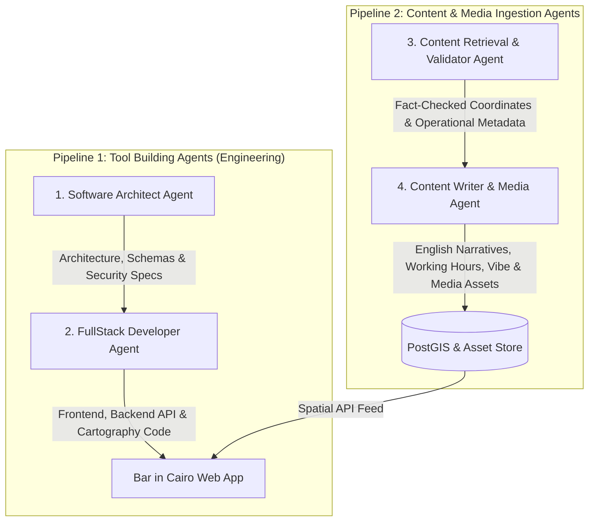

# System & Product Objective Specification: Bar in Cairo

**Project Name**: Bar in Cairo (`barincairo.com`)  
**Scope**: Historic Downtown Cairo (*Wust El Balad*) & Egypt Nightlife Heritage  
**Architecture Model**: 2 Parallel Agent Pipelines (Tool Building vs. Content Ingestion)  

---

## 1. Core Vision & Purpose

* **Cultural Tribute**: A digital archive and spatial guide celebrating historic Downtown Cairo bars (*Wust El Balad*), expanding to encompass hidden gems, rooftops, and classic establishments across all of Egypt.
* **Hidden Gems Discovery**: Showcases historic spots, speakeasies, and local favorites that are often overlooked, preserving their cultural gravity, founding history, and literary connections.
* **Safe & Clean Bar Crawls**: Enables locals and international visitors to discover and navigate curated bar hops and walking trails in a safe, transparent, and respectful atmosphere.
* **English-Only Storytelling & Spatial Cartography**: Combines high-density spatial cartography with clear English narratives and operational details (including simple text working hours display 'from - to'), reflecting local historical terms (*Ahwa*, *Baladi Bar*, *Khedivial*) without generic commercialization.

---

## 2. Parallel Agent Pipeline Architecture

The system operates across **2 distinct parallel agent lines**: one dedicated to software engineering/tool building, and one dedicated to content retrieval, validation, and media generation.

---

### Pipeline 1: Tool Building Agents (Engineering)

#### 🤖 Agent 1: Software Architect Agent (`cairo-architect`)
* **Role**: System Architect & Technical Quality Authority.
* **Responsibilities**:
  * Designs spatial data schemas (PostGIS tables, GeoJSON payloads, working hours text fields).
  * Establishes zero-trust security controls (SEC-1.1 Pydantic payload validation, SEC-1.2 parameterized ORM queries, SEC-1.4 zero-secrets policy).
  * Enforces visual matrix guidelines (Khedivial color palette `#ede7d8`/`#24332d`/`#ad793b`, 44px touch targets, grain textures).

#### 🤖 Agent 2: FullStack Developer Agent (`cairo-developer`)
* **Role**: Frontend & Backend Implementation Engineer.
* **Responsibilities**:
  * Implements Next.js RSC components, MapLibre GL JS vector cartography, FastAPI backend routes, and SQLAdmin management views.
  * Authors Vitest and Pytest TDD unit/integration/admin test suites for frontend and backend modules.
  * Ensures zero-lint errors, strict TypeScript compliance (`"strict": true`), and high performance (Lighthouse $\ge 90$).

---

### Pipeline 2: Content & Media Ingestion Agents

#### 🤖 Agent 3: Content Retrieval & Validator Agent (`cairo-data-validator`)
* **Role**: Spatial GIS Researcher & Fact-Checker.
* **Responsibilities**:
  * Discovers spatial WGS84 coordinates ($\pm 0.0001^\circ$ precision) and physical street addresses across Cairo & Egypt.
  * Collects and validates operational metadata: working hours ('from - to' text display), price range ($–$$$), smoking policy, contact info, and Google Maps/OSM references.
  * Verifies coordinates against spatial bounding boxes to ensure locations fall accurately on valid street layouts.

#### 🤖 Agent 4: Content Writer & Media Agent (`cairo-content-media-writer`)
* **Role**: Cultural Storyteller, Copywriter & Visual Media Producer.
* **Responsibilities**:
  * Authors clear, engaging English narratives for Cairo nightlife heritage.
  * Conducts archival research on founding dates, architectural origins, literary history, and cinematic connections.
  * Documents safety guidelines, dress codes, atmosphere descriptions, working hours, and vibe tags (`ambient-music`, `flirty`, `oud-player`, `old-times`, `dancy`).
  * Manages, compresses, and links optimized visual media assets (WebP/AVIF formats, $\le 80\text{KB}$).

---

## 3. Data Integrity & Safety Standards

1. **Safety & Atmosphere First**: Every listed establishment includes verified entry conditions, dress code requirements, safety recommendations, and clear vibe classifications to ensure a comfortable experience for all visitors.
2. **Strict Spatial Precision**: Venue coordinates must fall within exact verified bounding boxes using spatial validation before entering the database.
3. **Khedivial Aesthetic Matrix**: All client components strictly adhere to the visual theme:
   * **Limestone Background**: `#ede7d8`
   * **Weathered Concrete**: `#b9ae96`
   * **Vintage Faded Gold**: `#ad793b`
   * **Deep Nile Green**: `#24332d`
   * **Dark Mahogany**: `#24332d`
