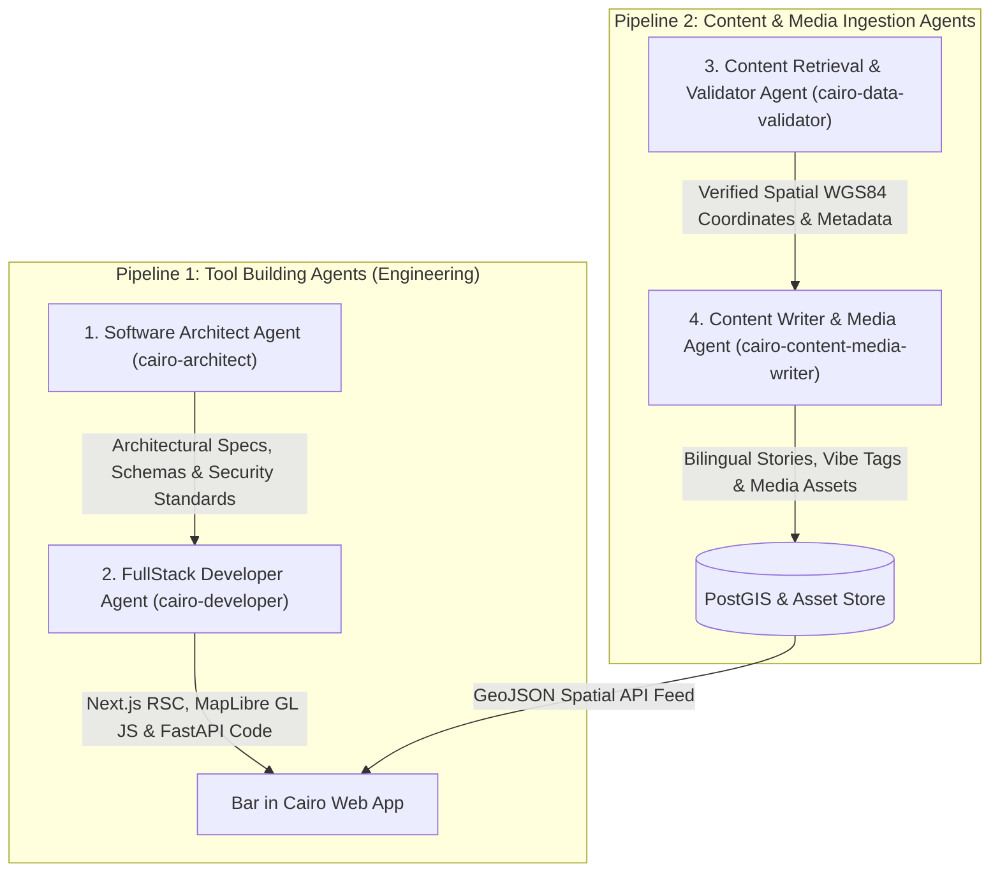

# System & Multi-Agent Pipeline Specification (`/spec`)

**Document Name**: Technical Specification (`SPEC.md`)  
**Project Name**: Bar in Cairo (`barincairo.com`)  
**Target Scope**: Historic Downtown Cairo (*Wust El Balad*) & Egypt Nightlife Heritage  
**System Model**: 2 Parallel Agent Pipelines (Tool Building vs. Content Ingestion)  

---

## 1. Executive Summary & System Purpose

* **Cultural Preservation & Tribute**: A digital spatial archive celebrating classic Downtown Cairo establishments (*Wust El Balad*), expanding to hidden gems, speakeasies, and rooftop lounges across all of Egypt.
* **Safe & Clean Bar Crawls**: Provides transparent, safe, and curated walking trails for locals and visitors to explore Cairo's nightlife history.
* **High-Density Cartography & Storytelling**: Integrates interactive WebGL maps (MapLibre GL JS) with rich bilingual narratives (Egyptian Arabic `_ar`, English, Dutch, French) that honor local cultural terminology.

---

## 2. Multi-Agent Pipeline Architecture

The system operates via **2 parallel, decoupled subagent pipelines**: Pipeline 1 builds and maintains the software application; Pipeline 2 retrieves, validates, authors, and ingests venue content and media.



---

## 3. Detailed Agent Specifications

### 3.1 Pipeline 1: Tool Building Agents

#### 🤖 Agent 1: Software Architect (`cairo-architect`)
* **Purpose**: System Design, Security Rules & Data Schema Specification.
* **System Prompt Specification**:
  ```yaml
  name: cairo-architect
  description: "Defines database schemas, GeoJSON API contracts, security rules, and visual matrix constraints for Bar in Cairo."
  tools: ["view_file", "write_to_file", "grep_search", "list_dir"]
  input_schema:
    feature_goal: "string"
    constraints: "object"
  output_schema:
    architecture_spec: "string"
    data_schemas: "object"
    security_rules: ["string"]
  verification_gate: "Must satisfy zero-trust security axioms (SEC-1.1 to SEC-1.5) and the Khedivial design matrix."
  ```

#### 🤖 Agent 2: FullStack Developer (`cairo-developer`)
* **Purpose**: Code Implementation, Cartography UI & TDD Test Suites.
* **System Prompt Specification**:
  ```yaml
  name: cairo-developer
  description: "Implements Next.js RSC components, MapLibre GL JS maps, FastAPI backend routes, and TDD harnesses."
  tools: ["view_file", "replace_file_content", "multi_replace_file_content", "write_to_file", "run_command"]
  input_schema:
    spec_document: "file_path"
    target_components: ["string"]
  output_schema:
    implemented_files: ["file_path"]
    test_results: "PASS | FAIL"
  verification_gate: "All Vitest and Pytest test suites must pass cleanly with 0 type errors and 0 lint warnings."
  ```

---

### 3.2 Pipeline 2: Content & Media Ingestion Agents

#### 🤖 Agent 3: Content Retrieval & Validator (`cairo-data-validator`)
* **Purpose**: GIS Spatial Verification & Metadata Fact-Checking.
* **System Prompt Specification**:
  ```yaml
  name: cairo-data-validator
  description: "Discovers and validates spatial WGS84 coordinates, street addresses, and operational details for venues across Egypt."
  tools: ["search_web", "read_url_content", "view_file"]
  input_schema:
    venue_name: "string"
    district: "string"
  output_schema:
    latitude: "float (WGS84)"
    longitude: "float (WGS84)"
    address_ar: "string"
    price_range: "string"
    opening_hours: "object"
  verification_gate: "Coordinates must fall strictly within verified Cairo/Egypt spatial bounding boxes (WGS84 precision ±0.0001°)."
  ```

#### 🤖 Agent 4: Content Writer & Media (`cairo-content-media-writer`)
* **Purpose**: Cultural Narrative Authoring, Safety Writing & Media Optimization.
* **System Prompt Specification**:
  ```yaml
  name: cairo-content-media-writer
  description: "Authors authentic bilingual narratives, historical context, safety tips, and manages compressed WebP/AVIF media assets."
  tools: ["view_file", "write_to_file", "search_web"]
  input_schema:
    validated_venue_data: "object"
    target_languages: ["ar", "en", "nl", "fr"]
  output_schema:
    narrative_ar: "string"
    translations: "object"
    vibe_tags: ["string"]
    safety_notes: "object"
    media_assets: ["file_path"]
  verification_gate: "Must preserve Cairo cultural terms (Ahwa, Baladi Bar, Khedivial) and optimize images to <= 80KB."
  ```

---

## 4. Operational & Aesthetic Axioms

### 4.1 Non-Functional Requirements (NFRs)
* **PERF-1.1**: Target Lighthouse Mobile score $\ge 90$ with LCP $\le 1.2\text{s}$ and TTFB $< 200\text{ms}$.
* **SEC-1.1**: Zero-Trust Data Ingestion — all spatial coordinates and JSON payloads validated via Pydantic schemas (HTTP 422 on invalid input).
* **SEC-1.2**: SQL Injection Immunity — all database interactions execute through parameterized GeoAlchemy2 / SQLAlchemy ORM methods.
* **SEC-1.4**: Zero Secrets in Code — passwords and secret keys loaded strictly from `.env` template.

### 4.2 Khedivial Aesthetic Matrix
* **Colors**: Khedivial Limestone (`#ede7d8`), Weathered Concrete (`#b9ae96`), Vintage Gold (`#ad793b`), Nile Emerald (`#24332d`), Dark Mahogany (`#24332d`).
* **Touch Targets**: Minimum **44x44 CSS pixels** for all interactive map markers, category toggles, and CTAs.
* **Typography**: Bilingual typography featuring Serif/Cinematic headers for 1950s Cairo heritage, coupled with legible sans-serif for spatial data.

---

## 5. Technical Data Schemas & API Contracts

### 5.1 Relational 3NF Database Schema (PostgreSQL + PostGIS)

```python
class Venue(Base):
    __tablename__ = "venues"

    id: Mapped[int] = mapped_column(Integer, primary_key=True, autoincrement=True)
    slug: Mapped[str] = mapped_column(String(100), unique=True, index=True, nullable=False)
    name_ar: Mapped[str] = mapped_column(String(150), nullable=False)
    address_ar: Mapped[str] = mapped_column(String(255), nullable=False)
    description_ar: Mapped[str] = mapped_column(Text, nullable=False)
    
    # JSONB Localized Translation Dictionary (en, nl, fr)
    translations: Mapped[dict] = mapped_column(JSONB, nullable=False, default=dict)

    # PostGIS Spatial Point (WGS84 4326)
    location: Mapped[Geometry] = mapped_column(
        Geometry(geometry_type="POINT", srid=4326), nullable=False
    )

    # Operational & Safety Attributes
    price_range: Mapped[str] = mapped_column(String(10), nullable=False) # '$', '$$', '$$$'
    vibe_tags: Mapped[list[str]] = mapped_column(JSONB, nullable=False)
    opening_hours: Mapped[dict] = mapped_column(JSONB, nullable=False)
    safety_notes: Mapped[dict] = mapped_column(JSONB, nullable=True)
    hero_image: Mapped[str] = mapped_column(String(255), nullable=True)
```

### 5.2 GeoJSON Endpoint Contract (`GET /api/v1/venues`)

```json
{
  "type": "FeatureCollection",
  "features": [
    {
      "type": "Feature",
      "geometry": {
        "type": "Point",
        "coordinates": [31.2389, 30.0444]
      },
      "properties": {
        "id": 1,
        "slug": "cap-d-or",
        "name_ar": "كاب دي أور",
        "name_en": "Cap D'Or",
        "address_ar": "شارع عبد الخالق ثروت، وسط البلد",
        "price_range": "$$",
        "vibe_tags": ["old-times", "ambient-music"],
        "hero_image": "/images/venues/cap-d-or.webp",
        "detail_url": "/venues/cap-d-or"
      }
    }
  ]
}
```

---

## 6. Verification & Quality Sign-Off

1. **Frontend TDD**: Executed via Vitest (`npm run test`) to verify MapLibre marker sync, filter state changes, and tooltip card touch targets.
2. **Backend TDD**: Executed via Pytest (`pytest backend/`) to verify spatial queries, GeoJSON generation, Pydantic 422 validations, and rate-limiting.
3. **CI/CD Integration**: Strict GitHub Actions deployment block on linting (`eslint`, `ruff`) or TypeScript compilation errors (`tsc --noEmit`).
