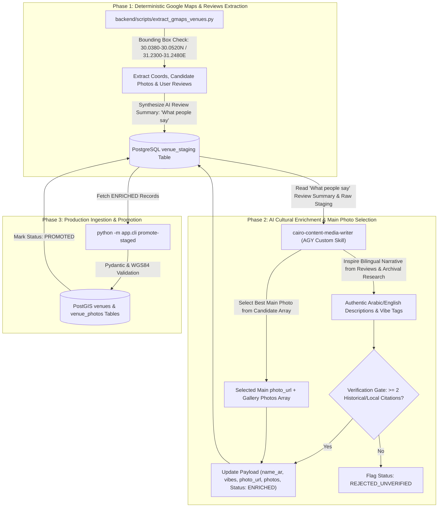

# Architectural Specification: Google Maps Search & Content Ingestion Pipeline (`cairo-data-validator`)

**Document Path**: `ai-work/spec/content-retrieval-agent-spec.md`  
**Feature Goal**: Define the end-to-end architecture for Google Maps spatial extraction, PostgreSQL staging (`venue_staging`), Google Reviews AI summary ("What people say"), AI cultural enrichment (`cairo-content-media-writer`), main photo selection from candidate photo pools, and production PostGIS promotion.  
**Author**: `cairo-architect`  
**Date**: 2026-08-14  
**Status**: Approved Specification  

---

## 1. Objective & Overview

Establish an automated, repeatable 3-phase hybrid ingestion pipeline:
1. **Google Maps Spatial & Review Extraction**: Extract raw spatial data, candidate photo arrays, and Google reviews across Downtown Cairo venues deterministically from Google Maps/Places API within strict bounding boxes (`30.0380°N–30.0520°N`, `31.2300°E–31.2480°E`). Synthesize an AI Review Summary **"What people say"** stored in staging.
2. **PostgreSQL Staging & AI Cultural Enrichment**: Deduplicate by `place_id` in `venue_staging` table. An AI Subagent (`cairo-content-media-writer`) uses the staged **"What people say"** review summary as inspiration to author authentic Egyptian Arabic titles (`name_ar`), rich descriptions, Khedivial vibe taxonomy, price ranges, select the **main hero photo**, and satisfy the **2-Citation Verification Gate**.
3. **Production PostGIS Promotion**: Validate using Pydantic (`VenueIngestSchema`) and promote staged records into PostGIS `venues` and `venue_photos` tables via CLI subcommands (`python -m app.cli promote-staged`) or SQLAdmin interface.

---

## 2. Pipeline Architecture & Flow



---

## 3. Data Schema & Feature Specifications

### 3.1 Reviews AI Summary ("What people say") in Staging
1. **Extraction**: Phase 1 retrieves up to 5 top relevant Google user reviews (`reviews: list[dict]`).
2. **Synthesis**: An AI summarizer compiles key atmosphere notes, signature drinks/dishes, patron sentiment, and noise levels into a concise **"What people say"** summary block (`what_people_say: str`).
3. **Staging Storage**: Stored inside `venue_staging.raw_payload['what_people_say']`.
4. **Copywriter Inspiration**: Used exclusively by `cairo-content-media-writer` in Phase 2 to ground description copy in real visitor experiences without directly copying unverified raw review text.

### 3.2 Main Photo Selection Criteria
1. **Selection Heuristics**: Evaluates candidate photos for high resolution ($\ge 800\text{px}$ width), exterior/interior architectural presence, clear lighting, and absence of heavy text watermarks.
2. **Primary Assignment**: The single highest-scoring image is designated as `photo_url` (hero photo on `Venue`).
3. **Gallery Assignment**: Remaining valid candidate photos are assigned to `photos` array (ingested into `venue_photos` table).

### 3.3 Staging Table (`venue_staging`)
```sql
CREATE TABLE venue_staging (
    id UUID PRIMARY KEY DEFAULT gen_random_uuid(),
    place_id VARCHAR(255) UNIQUE NOT NULL,
    name_raw VARCHAR(255) NOT NULL,
    address_raw TEXT NOT NULL,
    location GEOMETRY(Point, 4326) NOT NULL,
    raw_payload JSONB NOT NULL, -- Includes photos array, reviews list, and 'what_people_say' summary
    enriched_payload JSONB,    -- Includes selected main photo_url, gallery photos, name_ar, descriptions
    status VARCHAR(50) DEFAULT 'PENDING_CURATION', -- PENDING_CURATION, ENRICHED, PROMOTED, REJECTED
    created_at TIMESTAMP WITH TIME ZONE DEFAULT CURRENT_TIMESTAMP,
    updated_at TIMESTAMP WITH TIME ZONE DEFAULT CURRENT_TIMESTAMP
);
```

### 3.4 Pydantic Validation Schema (`VenueIngestSchema`)
- `slug`: `str` (unique identifier)
- `category_slug`: `str` (`historic-pub`, `rooftop-bar`, `bistro-lounge`, `cabaret-bar`, `speakeasy`, `pub`, `lounge`)
- `name_en` / `name_ar`: `str` (bilingual name)
- `description_en` / `description_ar`: `str` (bilingual narrative inspired by 'What people say' and historical research)
- `address_en` / `address_ar`: `str` (formatted street address)
- `latitude` / `longitude`: `float` (WGS84 within `30.0300°N–30.0600°N`, `31.2300°E–31.2500°E`)
- `price_range`: `$` | `$$` | `$$$`
- `vibe_description`: `str` | `None`
- `photo_url`: `str` (Selected main hero photo URL)
- `gallery_photos`: `list[str]` (Secondary candidate photos for `venue_photos`)
- `vibes`: `list[str]` (`fancy`, `ambient-music`, `live-performance`, `oud-player`, `old-times`, `dancy`, `flirty`)
- `citations`: `list[str]` (minimum 2 verified external references)

---

## 4. Operational CLI Subcommands

- Extract Google Maps places, photos & reviews:
  ```bash
  python -m backend.scripts.extract_gmaps_venues --bbox "30.0380,31.2300,30.0520,31.2480"
  ```
- Run AI enrichment, photo selection & review summary synthesis:
  ```bash
  python -m app.cli enrich-staged
  ```
- Promote enriched records to production PostGIS tables:
  ```bash
  python -m app.cli promote-staged [--all]
  ```

---

## 5. Verification & Testing Criteria
- `pytest backend/tests/test_content_validator.py` passes 100%.
- Bounding box checks reject any venue outside Downtown Cairo boundaries.
- `what_people_say` review summary is generated and present in `raw_payload` for all staged venues.
- Main photo selection guarantees a non-null primary `photo_url` for every promoted venue.
- Payloads with $< 2$ citations are rejected automatically by Pydantic validation.
- SQLAdmin interface displays `what_people_say` review summary alongside staging records for operator review.
