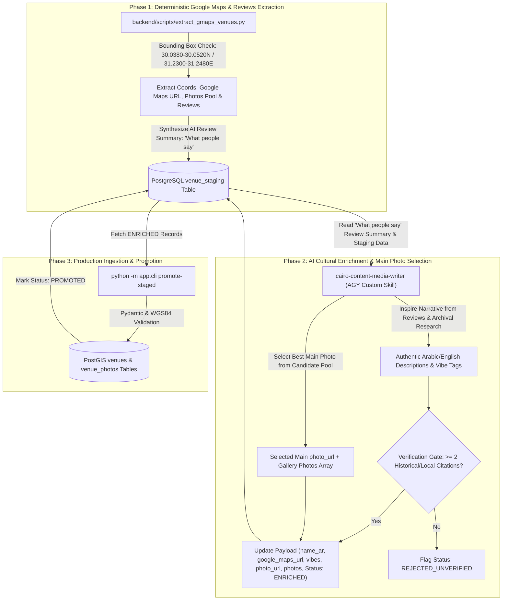

# Architectural Specification: Hybrid Content Ingestion Pipeline

**Document Path**: `ai-work/spec/hybrid-content-ingestion-pipeline-spec.md`  
**Feature Goal**: Unified master specification for deterministic Google Places/Maps extraction (with direct Google Maps links, candidate photo pools, and user reviews), PostgreSQL staging (`venue_staging`), AI cultural enrichment (`cairo-content-media-writer`), main hero photo selection, and production PostGIS DB promotion.  
**Author**: `cairo-architect`  
**Date**: 2026-08-14 (Unified Master Edition)  
**Status**: Approved Specification  

---

## 1. Executive Summary & Single Source of Truth

This document serves as the **single authoritative specification** for the `barincairo.com` hybrid content ingestion pipeline. It unifies deterministic spatial extraction with AI cultural enrichment to transition from static seeding to continuous venue discovery and curation.

### Key Pipeline Capabilities:
1. **Google Maps Extraction**: Deterministic spatial extraction of place ID, WGS84 coordinates, formatted address, candidate photo pool, top reviews, and **Direct Google Maps Link** (`google_maps_url`).
2. **Staging Queue (`venue_staging`)**: Deduplication in PostgreSQL by `place_id` and PostGIS spatial proximity (`ST_DWithin`). Holds raw extraction payloads, candidate photo pools, and an AI Review Summary **"What people say"** (`what_people_say`).
3. **AI Cultural Enrichment**: An AI subagent (`cairo-content-media-writer`) uses the staged reviews summary and archival research to author Egyptian Arabic titles (`name_ar`), authentic descriptions, Khedivial vibe taxonomy, select the **main hero photo**, and satisfy the **2-Citation Verification Gate**.
4. **Production Promotion & SQLAdmin**: Zero-trust Pydantic validation (`VenueIngestSchema`) before promoting verified records into production `venues` and `venue_photos` PostGIS tables.

---

## 2. Architecture & 4-Phase Ingestion Workflow



---

## 3. Detailed Component & Schema Specifications

### 3.1 Direct Google Maps Link & Metadata Extraction
Every extracted venue record MUST include:
- `place_id`: Google Places API unique identifier.
- `google_maps_url`: Direct URL to open place on Google Maps (e.g., `https://www.google.com/maps/place/?q=place_id:<PLACE_ID>`).
- `location`: WGS84 point (`longitude`, `latitude`) strictly within Downtown Cairo bounding box (`30.0380°N–30.0520°N`, `31.2300°E–31.2480°E`).
- `candidate_photos`: List of up to 10 photo references/URLs.
- `reviews`: Top 5 relevant user review text snippets.
- `what_people_say`: AI-generated review summary block stored in `venue_staging.raw_payload['what_people_say']`.

### 3.2 Main Hero Photo Selection Logic
- Evaluates candidate photos for resolution ($\ge 800\text{px}$ width), exterior/interior architectural clarity, and absence of text watermarks.
- Highest-scoring photo is assigned to `photo_url` (hero photo on `Venue`).
- Remaining candidate photos are stored in `gallery_photos` for ingestion into `venue_photos`.

### 3.3 Staging Table Schema (`venue_staging`)
```sql
CREATE TABLE venue_staging (
    id UUID PRIMARY KEY DEFAULT gen_random_uuid(),
    place_id VARCHAR(255) UNIQUE NOT NULL,
    google_maps_url TEXT NOT NULL,
    name_raw VARCHAR(255) NOT NULL,
    address_raw TEXT NOT NULL,
    location GEOMETRY(Point, 4326) NOT NULL,
    raw_payload JSONB NOT NULL, -- Contains candidate_photos, reviews, and 'what_people_say'
    enriched_payload JSONB,    -- Contains selected main photo_url, gallery_photos, name_ar, descriptions, citations
    status VARCHAR(50) DEFAULT 'PENDING_CURATION', -- PENDING_CURATION, ENRICHED, PROMOTED, REJECTED
    created_at TIMESTAMP WITH TIME ZONE DEFAULT CURRENT_TIMESTAMP,
    updated_at TIMESTAMP WITH TIME ZONE DEFAULT CURRENT_TIMESTAMP
);

CREATE INDEX idx_staging_location ON venue_staging USING GIST (location);
CREATE INDEX idx_staging_status ON venue_staging(status);
```

### 3.4 Production Pydantic Ingestion Schema (`VenueIngestSchema`)
```python
class VenueIngestSchema(BaseModel):
    slug: str
    category_slug: str
    name_en: str
    name_ar: str
    description_en: str | None = None
    description_ar: str | None = None
    address_en: str
    address_ar: str
    google_maps_url: str
    latitude: float
    longitude: float
    price_range: Literal["$", "$$", "$$$"] = "$$"
    vibe_description: str | None = None
    photo_url: str  # Selected main hero photo URL
    gallery_photos: list[str] = []
    vibes: list[str] = []
    citations: list[str] = Field(..., min_length=2)  # Mandatory 2-citation verification gate
```

---

## 4. Operational CLI Subcommands

1. **Extract Places & Reviews**:
   ```bash
   python -m backend.scripts.extract_gmaps_venues --bbox "30.0380,31.2300,30.0520,31.2480"
   ```
2. **AI Enrichment, Hero Photo Selection & Review Summarization**:
   ```bash
   python -m app.cli enrich-staged
   ```
3. **Promote Enriched Records to Production**:
   ```bash
   python -m app.cli promote-staged [--all]
   ```

---

## 5. Quality Control & Testing Requirements
- Pytest suite (`backend/tests/test_ingestion_pipeline.py`) verifying bounding box checks, 2-citation gate, photo selection, and staging promotion.
- SQLAdmin interface displaying `google_maps_url`, `what_people_say` review summary, and candidate photo array alongside staging records for manual operator review.
