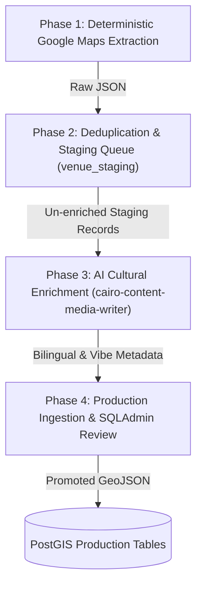

# Architectural Specification: Hybrid Content Ingestion Pipeline

**Document Path**: `ai-work/spec/hybrid-content-ingestion-pipeline-spec.md`  
**Feature Goal**: Establish an automated, repeatable 4-phase hybrid ingestion pipeline combining deterministic Google Places/Maps spatial extraction (for 100% accurate WGS84 coordinates across 40-50+ Downtown Cairo venues) with AI cultural enrichment (`cairo-content-media-writer`) for Egyptian Arabic localization, vibe taxonomy, and production database staging.  
**Author**: `cairo-architect`  
**Date**: 2026-08-13  
**Status**: Approved Specification  

---

## 1. Objective

Replace static single-batch seeding with a scalable, continuous ingestion process. This pipeline extracts raw spatial data for all 40–50+ Downtown Cairo establishments (and future regional expansions) from Google Maps/Places deterministically, stages and deduplicates records in PostgreSQL, enriches them with authentic Egyptian Arabic titles and Khedivial vibe metadata via AI agents, and exposes them in SQLAdmin for operator verification.

---

## 2. Scope & Boundaries

### 2.1 In-Scope Target Modules
- `backend/app/models/staging.py` (`VenueStaging` table)
- `backend/app/schemas/staging.py`
- `backend/scripts/extract_gmaps_venues.py`
- `backend/scripts/process_venues.py`
- `backend/app/admin/views.py` (`VenueStagingAdmin` view in SQLAdmin)
- `ai-work/tasks/ingestion-pipeline-tasks.md`

### 2.2 Out-of-Scope / Non-Goals
- Real-time live Google Places API queries on user HTTP page loads (all extracted data is cached, enriched, and stored in PostgreSQL to maintain TTFB $< 200\text{ms}$).

---

## 3. Architecture & 4-Phase Ingestion Process



### 3.1 Phase 1: Deterministic Google Maps Extraction (`extract_gmaps_venues.py`)
- Queries Google Places API / Maps within Downtown Cairo bounding box (SW: `30.0380, 31.2300`, NE: `30.0520, 31.2480`).
- Target Types: `bar`, `night_club`, `cafe`, `restaurant`, `lodging`.
- Extracts: `place_id`, `name`, `formatted_address`, `geometry.location` (`lat`/`lng`), `rating`, `user_ratings_total`, `price_level`, `website`, `formatted_phone_number`, `photos`.
- Output: `data/raw/gmaps_downtown_venues.json`.

### 3.2 Phase 2: Deduplication & Staging Table (`VenueStaging`)
- Table Schema: `venue_staging`
```sql
CREATE TABLE venue_staging (
    id UUID PRIMARY KEY DEFAULT gen_random_uuid(),
    place_id VARCHAR(255) UNIQUE NOT NULL,
    name_raw VARCHAR(255) NOT NULL,
    address_raw TEXT NOT NULL,
    location GEOMETRY(Point, 4326) NOT NULL,
    raw_payload JSONB NOT NULL,
    status VARCHAR(50) DEFAULT 'PENDING_CURATION', -- PENDING_CURATION, ENRICHED, PROMOTED, REJECTED
    created_at TIMESTAMP WITH TIME ZONE DEFAULT CURRENT_TIMESTAMP
);

CREATE INDEX idx_staging_location ON venue_staging USING GIST (location);
```
- Deduplication Rule: Checks `place_id` and PostGIS spatial proximity (`ST_DWithin(location::geography, existing_location::geography, 10)`) to flag potential duplicate establishments.

### 3.3 Phase 3: AI Cultural Enrichment (`cairo-content-media-writer`)
- Processes records with `status = 'PENDING_CURATION'`.
- Enriches each record with:
  - `name_ar`: Authentic Egyptian Arabic local title (e.g., `"بار الحرية"`, `"كاب دور"`).
  - `address_ar`: Arabic street address in Downtown Cairo.
  - `description_en` & `description_ar`: Cultural narrative highlighting history, atmosphere, and local terminology.
  - `vibe_tags`: Khedivial taxonomy array (`["old-times", "ambient-music", "fancy", "ahwa-baladi"]`).
  - `safety_notes`: Neighborhood navigation guidance for night visitors.

### 3.4 Phase 4: Production Ingestion & SQLAdmin Review (`process_venues.py`)
- Promotes enriched records into production `venues` table.
- Exposes `VenueStagingAdmin` view in `/admin` for operator approval and status toggling.
- CLI Execution Command:
  ```bash
  python -m backend.scripts.process_venues --bbox "30.038,31.230,30.052,31.248" --enrich --promote
  ```

---

## 4. Zero-Trust Security & Compliance Checklist (SEC-1.1 to SEC-1.5)

- [ ] **SEC-1.1**: All incoming Google Places raw JSON payloads parsed and validated strictly via Pydantic schemas.
- [ ] **SEC-1.2**: All PostGIS spatial proximity deduplication checks execute via parameterized SQLAlchemy ORM queries (`ST_DWithin`).
- [ ] **SEC-1.3**: Arabic titles (`name_ar`) and description text sanitized and validated prior to database insertion.
- [ ] **SEC-1.4**: Google Places API key loaded dynamically via environment variable (`GOOGLE_PLACES_API_KEY`) without hardcoded tokens.
- [ ] **SEC-1.5**: Extraction script rate-limited to avoid API quota throttling.

---

## 5. Testing & Verification Strategy

- **Pytest Suite**: Create `backend/tests/test_ingestion_pipeline.py` verifying:
  - Google Places API response parsing and schema validation.
  - Spatial deduplication logic against existing PostGIS geometries.
  - Staging status transition lifecycle (`PENDING_CURATION` $\rightarrow$ `ENRICHED` $\rightarrow$ `PROMOTED`).
- **Vitest Suite**: `npm test -- --run` to verify frontend rendering of promoted venues remains 100% clean.

---

## 6. Handoff Instructions

1. **Create Staging Model**: Add `VenueStaging` model in `backend/app/models/staging.py`.
2. **Build Extraction Script**: Implement `backend/scripts/extract_gmaps_venues.py` using `googlemaps` Python SDK or HTTP client.
3. **Build Processing & AI Pipeline**: Implement `backend/scripts/process_venues.py` incorporating deduplication and AI enrichment logic.
4. **Register SQLAdmin View**: Add `VenueStagingAdmin` in `backend/app/admin/views.py`.
5. **Add Integration Tests**: Implement `backend/tests/test_ingestion_pipeline.py`.
6. **Verification**: Run Pytest & Vitest harnesses to confirm 100% pass rate.
