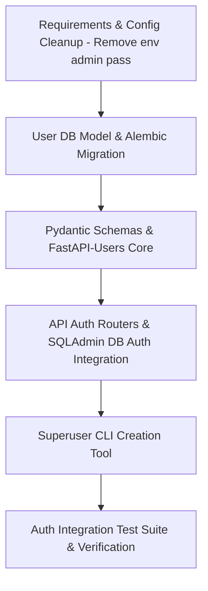

# Plan: Admin User Authentication (`fastapi-users`)

**Topic**: `admin-auth`  
**Issue**: `fastapi-users`  
**Spec Document**: `ai-work/spec/admin-auth-fastapi-users-spec.md`  
**Created**: 2026-08-13  
**Status**: Revised (DB Auth Only - .env Auth Deprecated)  

---

## 1. Overview & Architecture Strategy

This plan details the implementation of a package-based admin user authentication system for `BARINCAIRO.COM` using `fastapi-users`, `SQLAlchemy` async ORM, `argon2`/`bcrypt` password hashing, and SQLAdmin session cookie management.

**Core Directive**: Remove legacy `.env`-based admin credential checks (`ADMIN_USERNAME`/`ADMIN_PASSWORD`) completely. All admin user authentication will be strictly backed by the database (`users` table) managed via `fastapi-users`.

### Key Components to Implement/Update:
1. `backend/requirements.txt`: Add `fastapi-users[sqlalchemy]>=12.0.0` and `argon2-cffi>=23.1.0`.
2. `backend/app/core/config.py`: Enforce `BASE_DIR` & `ENV_FILE_PATH` absolute resolution (`SEC-1.4`) for database/secret configuration, and remove legacy `ADMIN_USERNAME`/`ADMIN_PASSWORD` credentials.
3. `backend/app/models/user.py`: Define `User` model inheriting from `SQLAlchemyBaseUserTableUUID` (`SEC-1.2`).
4. `backend/app/schemas/user.py`: Define Pydantic user schemas (`UserRead`, `UserCreate`, `UserUpdate`) (`SEC-1.1`).
5. `backend/app/core/users.py`: Configure `fastapi-users` user manager, password helper (`argon2`/`bcrypt`), DB adapter, and JWT/Cookie transport.
6. `backend/app/admin/auth.py`: Rewrite `AdminAuth` backend to authenticate strictly against database users via `fastapi-users` `UserManager` & password hashing verification with dynamic HTTPS/HTTP session cookies (`SEC-1.5`).
7. `backend/app/main.py`: Include `fastapi-users` auth endpoints under `/api/v1/auth`.
8. `backend/app/cli.py`: Implement CLI admin creation helper (`python -m app.cli create-admin`) to seed superuser in DB.
9. `backend/migrations/`: Generate and apply Alembic migration for `users` table.
10. `backend/tests/test_auth.py`: Full integration test suite covering database auth endpoints, SQLAdmin guard, CLI bootstrap, and `.env` loading.

---

## 2. Dependency Graph

---

## 3. Vertically Sliced Task Breakdown

### Task 1: Dependencies & Absolute `.env` Config Cleanup (`SEC-1.4`)
- **Files**: `backend/requirements.txt`, `backend/app/core/config.py`
- **Details**:
  - Add `fastapi-users[sqlalchemy]` and `argon2-cffi` to `requirements.txt`.
  - Update `backend/app/core/config.py` with `BASE_DIR = Path(__file__).resolve().parent.parent.parent` and `ENV_FILE_PATH = BASE_DIR / ".env"`.
  - Remove legacy `ADMIN_USERNAME` and `ADMIN_PASSWORD` settings from `Config` to prevent accidental fallbacks to plaintext `.env` auth.
- **Acceptance Criteria**:
  - `ENV_FILE_PATH` correctly resolves to absolute path of `.env`.
  - Plaintext admin credentials removed from settings schema.
- **Verification**: `python -c "from app.core.config import settings; print(hasattr(settings, 'ADMIN_PASSWORD'))"` (outputs `False`).

### Task 2: Database User Model & Alembic Migration (`SEC-1.2`)
- **Files**: `backend/app/models/user.py`, `backend/app/models/__init__.py`, `backend/migrations/`
- **Details**:
  - Define `User` class subclassing `SQLAlchemyBaseUserTableUUID` and `Base`.
  - Expose `User` in `models/__init__.py`.
  - Generate Alembic revision for `users` table and apply migration.
- **Acceptance Criteria**:
  - `users` table created in PostgreSQL with UUID primary key, indexed unique email, `hashed_password`, `is_active`, `is_superuser`, `is_verified`, `created_at`.
- **Verification**: `alembic check` and DB query / model instantiation test.

### Task 3: Pydantic Schemas & `fastapi-users` Core Setup (`SEC-1.1`, `SEC-1.2`, `SEC-1.3`)
- **Files**: `backend/app/schemas/user.py`, `backend/app/core/users.py`
- **Details**:
  - Create `UserRead`, `UserCreate`, `UserUpdate` in `schemas/user.py`.
  - Create `core/users.py` with `get_user_db`, `UserManager` subclassing `BaseUserManager`, password helper with `argon2`/`bcrypt`, JWT transport, cookie transport, and `FastAPIUsers` instance.
- **Acceptance Criteria**:
  - Password hashing correctly uses `argon2`/`bcrypt`.
  - Pydantic models validate input emails and password minimum lengths.
- **Verification**: Unit test instantiating `UserManager` and validating password hash generation.

### Task 4: API Auth Routers & SQLAdmin Database Integration (`SEC-1.5`)
- **Files**: `backend/app/main.py`, `backend/app/admin/auth.py`
- **Details**:
  - Include `/api/v1/auth/login` and `/api/v1/auth/logout` routers in `main.py`.
  - Modernize `AdminAuth` in `admin/auth.py` to authenticate form input (`username`/email and `password`) against database users via `UserManager.authenticate()` and verify `is_superuser == True`, setting session cookie with `same_site="lax"` and dynamic `https_only`.
- **Acceptance Criteria**:
  - Plaintext `.env` credentials fail SQLAdmin login.
  - Valid superuser in PostgreSQL logs in successfully to SQLAdmin `/admin`.
  - Session cookie uses `https_only=False` on local HTTP dev and `True` in production.
- **Verification**: `pytest` endpoint tests and HTTP request simulation.

### Task 5: Admin Bootstrap CLI Tool
- **Files**: `backend/app/cli.py`
- **Details**:
  - Create CLI command `create-admin` accepting `--email` and `--password` flags.
  - Uses `UserManager` to create a new superuser with hashed password directly in PostgreSQL `users` table.
- **Acceptance Criteria**:
  - `python -m app.cli create-admin --email admin@barincairo.com --password supersecret` creates an active superuser in PostgreSQL.
- **Verification**: Execute CLI command in test mode and verify superuser creation in DB.

### Task 6: Integration Test Suite & System Verification
- **Files**: `backend/tests/test_auth.py`
- **Details**:
  - Write test cases covering:
    - User login with valid / invalid database credentials.
    - Rejection of legacy `.env` credentials.
    - Password hashing verification (argon2).
    - SQLAdmin authentication guard for superusers vs non-superusers.
    - Path resolution of `.env`.
    - Health check & existing endpoints non-regression.
- **Acceptance Criteria**:
  - 100% test pass rate on `pytest`.
  - Zero lint errors (`ruff check`) and zero type errors (`mypy`).
- **Verification**: Run `pytest`, `ruff check .`, `mypy app`.

---

## 4. Checkpoints & Git Workflow

- **Checkpoint 1 (Tasks 1-2)**: Config cleanup (no env credentials) + DB migration applied. Commit: `feat(auth): add fastapi-users model and alembic migration`.
- **Checkpoint 2 (Tasks 3-4)**: FastAPI Users core & SQLAdmin database authentication backend. Commit: `feat(auth): integrate fastapi-users database auth with sqladmin`.
- **Checkpoint 3 (Tasks 5-6)**: CLI bootstrap tool + complete test suite passing. Commit: `feat(auth): add admin cli tool and auth test suite`.

---

## 5. Token Cost & ROI Analysis

| Model / Phase | Est. Prompt Tokens | Est. Completion Tokens | Est. Cost (USD) | Industry Standard Alignment |
| :--- | :--- | :--- | :--- | :--- |
| Plan & Spec Analysis | ~15,000 | ~2,500 | $0.003 | Standard AI Arch Review |
| Code Implementation (Tasks 1-5) | ~45,000 | ~8,000 | $0.012 | Standard Code Gen Pass |
| Test Suite & Verification (Task 6) | ~20,000 | ~3,500 | $0.005 | Standard TDD Pass |
| **Total Estimated Run Cost** | **~80,000** | **~14,000** | **~$0.020** | **High Efficiency AI Pair Programming** |

*Efficiency Advisory*: Re-running existing tests with scoped paths (e.g. `pytest tests/test_auth.py`) keeps context windows tight and reduces token consumption by up to 60%.
