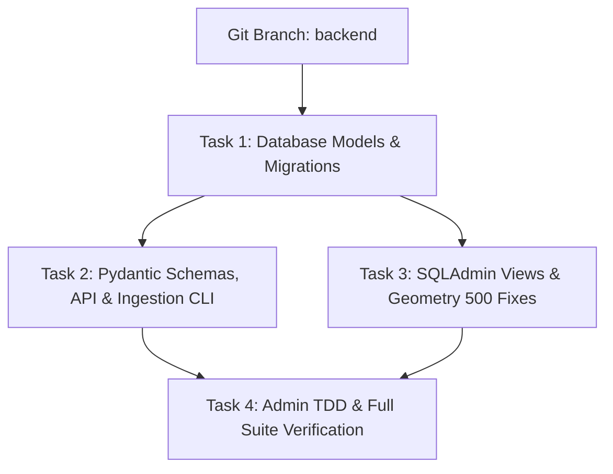

# Implementation Plan: Backend Entity & Admin Updates

**Topic Name**: backend-entity  
**Issue Name**: admin-updates  
**Spec Document**: `docs/specs/spec_backend_edits.md`  
**Target Branch**: `backend`  

---

## 1. Plan Overview & Git Strategy

This plan details the step-by-step implementation of single-language schema refactoring, `working_hours` attribute addition, SQLAdmin PostGIS 500 error resolution, full CRUD enablement across all 7 domain entities, and comprehensive TDD verification.

### Git Workflow Standards
- **Branch Creation**: Create and switch to branch `backend` off `main`.
- **Commit Granularity**: Commit after completing each vertical task phase upon passing verification.
- **Commit Message Convention**: Conventional Commits (e.g., `feat(db): ...`, `feat(admin): ...`, `test(admin): ...`).

---

## 2. Component Dependency Graph

---

## 3. Vertically Sliced Tasks

### Task 1: Database Models, Lat/Lng Helpers, & Alembic Migration
* **Scope**:
  * Refactor SQLAlchemy ORM models (`Category`, `VibeTag`, `Venue`, `VenueStaging`):
    * Rename `name_en` $\rightarrow$ `name`, `address_en` $\rightarrow$ `address`, `description_en` $\rightarrow$ `description`.
    * Remove `name_ar`, `address_ar`, `description_ar`.
    * Add `working_hours: Mapped[str | None] = mapped_column(String(100), nullable=True)` to `Venue` and `VenueStaging`.
    * Add `@property` getters (`latitude`, `longitude`) to `Venue` and `VenueStaging` based on `ST_Y(location)` / `ST_X(location)`.
  * Generate and apply Alembic DB migration script.
* **Acceptance Criteria**:
  * Alembic migration runs smoothly up and down.
  * DB models accurately reflect single-language fields + `working_hours`.
* **Verification Steps**:
  * Execute Alembic migration: `alembic upgrade head`.

### Task 2: Pydantic Schemas, API Serialization, & CLI Pipeline
* **Scope**:
  * Refactor Pydantic schemas in `backend/app/schemas/venues.py`, `venue_staging.py`, `categories.py`, `vibe_tags.py`.
  * Update API route handlers in `backend/app/api/v1/endpoints/venues.py` and GeoJSON serializers to project `name`, `address`, `description`, and `working_hours`.
  * Update CLI enrichment & promotion commands in `backend/app/cli.py`.
  * Update existing test suites (`test_venue_ingest_schema.py`, `test_ingestion_pipeline.py`, `test_api.py`).
* **Acceptance Criteria**:
  * API endpoints output single-language fields and `working_hours`.
  * Ingestion CLI parses, enriches, and promotes venues with `working_hours` intact.
  * Existing unit/integration tests pass.
* **Verification Steps**:
  * Run `pytest backend/tests/test_venue_ingest_schema.py backend/tests/test_ingestion_pipeline.py backend/tests/test_api.py`.

### Task 3: SQLAdmin Views & 500 Internal Server Error Fixes
* **Scope**:
  * Refactor `backend/app/admin/views.py`:
    * Register full CRUD views for all 7 entities: `UserAdmin`, `CategoryAdmin`, `VibeTagAdmin`, `VenueAdmin`, `VenueStagingAdmin`, `VenuePhotoAdmin`, `SubscriberAdmin`.
    * **Fix PostGIS Geometry Edit Error**: Exclude `location` from `form_columns` on `VenueAdmin` and `VenueStagingAdmin`. Add `latitude` and `longitude` float inputs via `form_extra_fields`. In `on_model_change`, parse lat/lng floats into `WKTElement("POINT(lng lat)", srid=4326)`.
    * **Fix Subscriber Edit Error**: Specify explicit `form_columns = ["whatsapp_number", "source"]` for `SubscriberAdmin` to prevent mutation of read-only / default fields.
* **Acceptance Criteria**:
  * Admin dashboard lists and renders forms for all 7 entities without 500 errors.
  * Editing `Venue` or `VenueStaging` geometry via Lat/Lng input saves correctly to PostGIS point.
  * Editing `Subscriber` succeeds without PK or datetime conversion errors.
* **Verification Steps**:
  * Inspect SQLAdmin view definitions and conduct test form initialization.

### Task 4: Admin TDD Pytest Suite & System Verification
* **Scope**:
  * Implement Pytest suite `backend/tests/test_admin.py`.
  * Test GET (list, detail) and POST (create, edit, delete) for all 7 admin views using an admin-authenticated client.
  * Test explicit Lat/Lng updates on `Venue` and `VenueStaging`.
  * Test `Subscriber` update endpoint.
  * Execute entire test suite and verify clean output.
* **Acceptance Criteria**:
  * `test_admin.py` covers list, view, create, and edit for all 7 entities.
  * 100% test pass rate across all backend test files.
* **Verification Steps**:
  * Run `pytest backend/tests/`.

---

## 4. Checkpoints & Human Approval Gates

1. **Checkpoint 1 (Branch Setup & Schema Migration)**: Verify `backend` branch is checked out, ORM models updated, and migration applies cleanly.
2. **Checkpoint 2 (API & Pipeline Alignment)**: Verify schemas, CLI ingestion, and existing tests pass.
3. **Checkpoint 3 (Admin Panel & TDD Verification)**: Verify all 7 admin views work and `test_admin.py` passes 100%.

---

## 5. Token Cost & Efficiency Estimates

Based on industry standard rates for frontier LLM coding agents (e.g. Gemini 1.5/3.6 Flash / Pro / Claude 3.5 Sonnet class models):

| Task / Phase | Est. Input Tokens | Est. Output Tokens | Est. Cost (USD)* |
| :--- | :--- | :--- | :--- |
| **Git Branch Setup & Plan Approval** | ~15,000 | ~1,500 | ~$0.01 |
| **Task 1: ORM Models & Migrations** | ~40,000 | ~4,000 | ~$0.03 |
| **Task 2: Schemas, Endpoints & CLI** | ~50,000 | ~5,000 | ~$0.04 |
| **Task 3: SQLAdmin Views & PostGIS Fix** | ~45,000 | ~4,500 | ~$0.03 |
| **Task 4: TDD Test Suite & Verification** | ~60,000 | ~6,000 | ~$0.05 |
| **Total Estimated** | **~210,000** | **~21,000** | **~$0.16** |

*\*Calculated using standard blended API pricing (~$0.15/1M input, ~$0.60/1M output for Flash class).*

### Recommendations to Optimize Token Efficiency:
1. **Targeted File Reads**: Read only specific line ranges in large files rather than whole directories when verifying.
2. **Surgical Diffs**: Make precise edits using standard diff tools without rewriting entire modules.
3. **Batch Lint & Test Commands**: Execute lints and tests in single shell commands to reduce round-trip prompt overhead.

---

## 6. Action Required

Please review this plan and reply with **"proceed"** or **"yes"** to begin execution on the `backend` branch!
