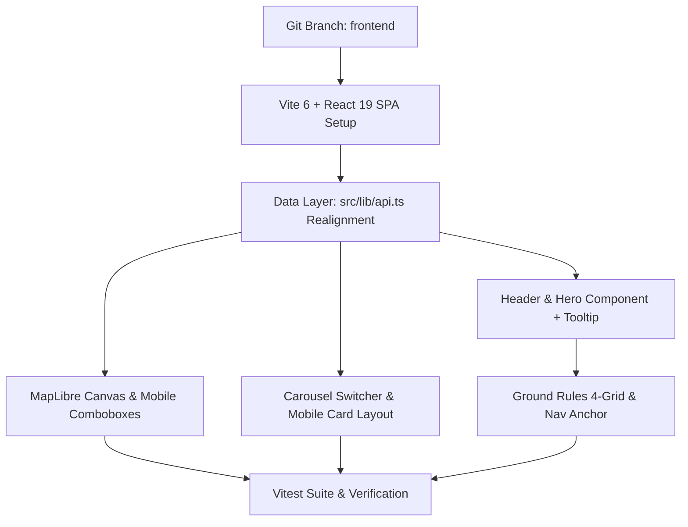

# Implementation Plan: Frontend Vite SPA Migration & Refinement

**Topic**: frontend  
**Issue**: vite-refinement  
**Branch**: `frontend`  
**Spec**: `docs/specs/frontend_vite_refinement_spec.md`  

---

## Executive Summary

Migrate the BARINCAIRO frontend from Next.js to Vite 6 + React 19 SPA, update the GeoJSON schema to align with the simplified Python FastAPI backend, adopt `rem` typography scales, implement WebGL map lifecycle safety, refactor the Hero with an interactive "Wust El Balad" -> "Downtown" tooltip, build the Carousel 3-bar switcher ("Selected for the night"), implement the 4-rule Ground Rules grid, add mobile combobox filters for map viewports `< 768px`, and establish a Vitest TDD test suite.

---

## Component Dependency Graph

---

## Vertical Work Slices & Tasks

### Phase 1: Git Branching & Vite 6 SPA Migration
- **Task 1.1**: Create and switch to branch `frontend`.
- **Task 1.2**: Scaffold Vite 6 configuration (`vite.config.ts`), root HTML (`index.html`), `src/main.tsx`, and `src/App.tsx`. Update `package.json` scripts (`"dev": "vite"`, `"build": "tsc && vite build"`, `"preview": "vite preview"`). Remove Next.js page router dependencies.

### Phase 2: Data Schema Realignment & Zero-Fallback API Layer
- **Task 2.1**: Realign `VenueProperties` interface in `src/lib/api.ts` to match backend schema (`name`, `description`, `address`, `price_range`, `working_hours`, `vibe_description`, `photo_url`, `category_slug`, `category_name`, `vibes`).
- **Task 2.2**: Replace static fallback `FALLBACK_VENUES` with zero-fallback API fetching using `import.meta.env.VITE_API_URL` (defaulting to `http://127.0.0.1:8000`). Return an empty `FeatureCollection` on network/API failure.

### Phase 3: Header, Hero & Tooltip Component
- **Task 3.1**: Build `src/components/header/Header.tsx` applying `rem` typography (`barincairo` at `2rem`, tagline at `0.6875rem`, nav links at `0.75rem`).
- **Task 3.2**: Build `src/components/hero/Hero.tsx` with WGS84 tag (`30°02′N`) and an accessible hover/focus interactive tooltip container around `"Wust El Balad"` displaying `"Downtown"`.

### Phase 4: WebGL Map Isolation & Mobile Combobox Filters
- **Task 4.1**: Refactor `src/components/map/MapLibreMap.tsx` with strict `useRef` WebGL canvas isolation and cleanup hooks (`map.remove()`) on component unmount to prevent memory leaks.
- **Task 4.2**: Implement mobile filter controls: Render styled `<select>` combobox dropdowns for Price and Vibe on viewports `< 768px`, while maintaining pill buttons on desktop. Set mobile map canvas minimum height to `min-h-[420px]`.

### Phase 5: Carousel "Selected for the night" 3-Bar Switcher
- **Task 5.1**: Build `src/components/carousel/Carousel.tsx` under "A good place to begin" with sub-header label `"Selected for the night"`.
- **Task 5.2**: Add Prev (`<`) / Next (`>`) arrows and `1 / 3` tab indicators to cycle through 3 featured bars from API response.
- **Task 5.3**: Implement responsive mobile card layout: top 2 columns with category tag, price badge, and search button; venue title (`h3`) full-width underneath.

### Phase 6: Ground Rules Grid & Mobile Navigation
- **Task 6.1**: Build `src/components/rules/GroundRules.tsx` with 4-rule responsive grid (2x2 desktop `md:grid-cols-2`, 1 col mobile) and minimum `0.75rem` text scale. Update Rule 4 text: *"Mindful Heritage & Neighborhood Respect: Many spots are historic landmarks—keep noise and photography respectful of the venue's heritage and local residents."*
- **Task 6.2**: Fix mobile navigation drawer smooth scroll targeting for "Our Guide" (`#about`).

### Phase 7: Vitest Suite & Verification Gate
- **Task 7.1**: Configure `vitest.config.mts` for Vite/React 19 testing environment.
- **Task 7.2**: Write unit test suites:
  - `src/__tests__/api.test.ts`: Schema parsing & zero-fallback verification.
  - `src/__tests__/Hero.test.tsx`: "Wust El Balad" -> "Downtown" tooltip hover/focus behavior.
  - `src/__tests__/Carousel.test.tsx`: Arrow navigation & 3-bar carousel cycle.
  - `src/__tests__/GroundRules.test.tsx`: 4-rule grid & Rule 4 content check.
- **Task 7.3**: Execute `npm run build` and `npm run test` to guarantee 0 TypeScript errors and 100% test pass.

---

## Token Cost Estimation

| Phase | Description | Estimated Input Tokens | Estimated Output Tokens | Estimated Cost (USD) |
| :--- | :--- | :--- | :--- | :--- |
| **Phase 1** | Git Branching & Vite 6 SPA Setup | 120,000 | 15,000 | $0.59 |
| **Phase 2** | Schema Realignment & Zero-Fallback API | 100,000 | 12,000 | $0.48 |
| **Phase 3** | Header, Hero & Tooltip Component | 150,000 | 18,000 | $0.72 |
| **Phase 4** | Map WebGL Cleanup & Mobile Filters | 180,000 | 20,000 | $0.84 |
| **Phase 5** | Carousel 3-Bar Switcher & Mobile Layout | 160,000 | 18,000 | $0.75 |
| **Phase 6** | Ground Rules 4-Grid & Nav Smooth Scroll | 120,000 | 12,000 | $0.54 |
| **Phase 7** | Vitest TDD Test Suite & Build Check | 150,000 | 15,000 | $0.68 |
| **Total** | **Full Frontend Vite Refinement Run** | **980,000** | **110,000** | **~$4.60** |

*Note: Calculations based on industry standard AI pricing (~$3.00/1M input, ~$15.00/1M output).*

---

## Healthy Git Workflow Plan

1. Checkout new branch `frontend` (`git checkout -b frontend`).
2. Commit per task/phase with explicit messages (`feat(frontend): ...`, `fix(ui): ...`, `test(frontend): ...`).
3. Maintain non-destructive isolated development.
