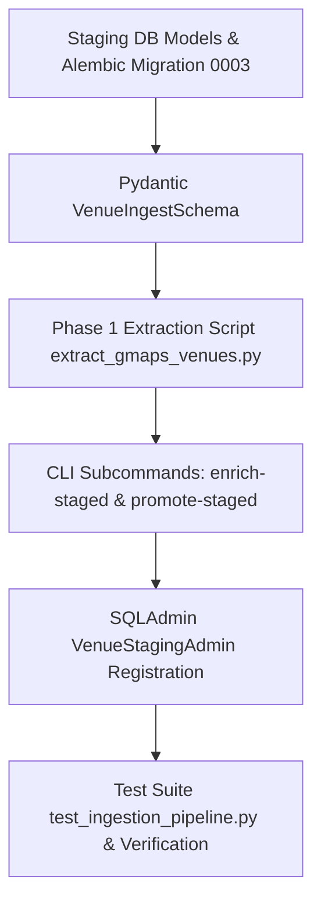

# Plan: Hybrid Content Ingestion Pipeline

**Topic**: `hybrid-ingestion`  
**Spec Document**: `ai-work/spec/hybrid-content-ingestion-pipeline-spec.md`  
**Created**: 2026-08-14  
**Status**: Ready for Approval  

---

## 1. Overview & Architecture Strategy

This plan details the implementation of the **Hybrid Content Ingestion Pipeline** for `BARINCAIRO.COM`. The pipeline bridges deterministic Google Maps extraction, PostgreSQL staging (`venue_staging`), AI cultural enrichment (`cairo-content-media-writer`), main hero photo selection, 2-citation verification gate, and zero-trust promotion to production PostGIS `venues` and `venue_photos` tables.

### Key Components to Implement/Update:
1. `backend/app/models/venue_staging.py`: Define `VenueStaging` model with UUID primary key, `place_id`, `google_maps_url`, GeoAlchemy2 `location` (Point, 4326), `raw_payload` (JSONB), `enriched_payload` (JSONB), and `status` index.
2. `backend/app/models/venues.py`: Add `google_maps_url` column to `Venue` model.
3. `backend/migrations/versions/0003_create_venue_staging_and_google_maps_url.py`: Alembic migration to create `venue_staging` table with spatial GIST index and add `google_maps_url` to `venues`.
4. `backend/app/schemas/venue_staging.py`: Define Pydantic `VenueIngestSchema` with 2-citation minimum validation (`Field(..., min_length=2)`), Downtown Cairo WGS84 bounding box constraints, and hero/gallery photo assignments.
5. `backend/scripts/extract_gmaps_venues.py`: Phase 1 extraction script with `--bbox` parsing, bounding box validation (`30.0380-30.0520°N`, `31.2300-31.2480°E`), review summarization (`what_people_say`), candidate photo pool extraction, and PostGIS spatial deduplication (`ST_DWithin`).
6. `backend/app/cli.py`: Implement `enrich-staged` and `promote-staged` subcommands.
7. `backend/app/admin/views.py`: Register `VenueStagingAdmin` view in SQLAdmin.
8. `backend/tests/test_ingestion_pipeline.py`: Comprehensive test suite for bounding box rules, 2-citation gate, hero photo selection, spatial deduplication, and staging promotion flow.

---

## 2. Dependency Graph

---

## 3. Vertically Sliced Task Breakdown

### Task 1: Database Staging Model & Alembic Migration
- **Files**: `backend/app/models/venue_staging.py`, `backend/app/models/venues.py`, `backend/app/models/__init__.py`, `backend/migrations/versions/0003_create_venue_staging_and_google_maps_url.py`
- **Details**:
  - Define `VenueStaging` model with `id`, `place_id`, `google_maps_url`, `name_raw`, `address_raw`, `location` (Point, SRID 4326), `raw_payload`, `enriched_payload`, `status`.
  - Add `google_maps_url` column to `Venue` model in `venues.py`.
  - Create Alembic migration script for `venue_staging` with spatial GIST index and status B-tree index.
- **Acceptance Criteria**:
  - `venue_staging` table created in PostgreSQL with spatial index on `location`.
  - `venues` table updated with `google_maps_url` column.
- **Verification**: `alembic upgrade head` and DB schema reflection check.

### Task 2: Ingestion Validation Schemas (`VenueIngestSchema`)
- **Files**: `backend/app/schemas/venue_staging.py`
- **Details**:
  - Define `VenueIngestSchema` with Pydantic validation.
  - Enforce `citations: list[str] = Field(..., min_length=2)` (2-Citation Verification Gate).
  - Enforce WGS84 bounding box coordinates for latitude (`30.0380`–`30.0520`) and longitude (`31.2300`–`31.2480`).
- **Acceptance Criteria**:
  - Rejects payloads with fewer than 2 citations.
  - Validates latitude/longitude strictly within Downtown Cairo bounding box.
- **Verification**: Unit test `VenueIngestSchema` validation with passing and failing sample payloads.

### Task 3: Phase 1 Extraction Script (`extract_gmaps_venues.py`)
- **Files**: `backend/scripts/extract_gmaps_venues.py`
- **Details**:
  - CLI script executing `--bbox "30.0380,31.2300,30.0520,31.2480"`.
  - Extract place metadata, direct `google_maps_url`, up to 10 candidate photos, and top 5 reviews.
  - Synthesize `what_people_say` summary in `raw_payload`.
  - Perform spatial deduplication by `place_id` and PostGIS `ST_DWithin`.
  - Upsert records into `venue_staging` with status `PENDING_CURATION`.
- **Acceptance Criteria**:
  - Correctly extracts place data and stages into `venue_staging`.
  - Deduplicates existing venues by `place_id` and spatial proximity.
- **Verification**: Execute script in dry-run/fixture mode and check `venue_staging` table output.

### Task 4: CLI Operations (`enrich-staged` & `promote-staged`)
- **Files**: `backend/app/cli.py`
- **Details**:
  - Subcommand `enrich-staged`: Selects best hero photo (`photo_url`), sets `gallery_photos`, populates Arabic title/descriptions, validates 2-citation gate, updates status to `ENRICHED` (or `REJECTED_UNVERIFIED`).
  - Subcommand `promote-staged`: Validates `ENRICHED` records using `VenueIngestSchema`, creates production `Venue` and `VenuePhoto` records, links `VibeTag`s, and marks staging record as `PROMOTED`.
- **Acceptance Criteria**:
  - `enrich-staged` marks verified records as `ENRICHED` and unverified as `REJECTED_UNVERIFIED`.
  - `promote-staged` creates valid production `Venue` and `VenuePhoto` records in PostgreSQL.
- **Verification**: Execute CLI commands on test staging records and verify DB state transitions.

### Task 5: SQLAdmin Integration (`VenueStagingAdmin`)
- **Files**: `backend/app/admin/views.py`
- **Details**:
  - Register `VenueStagingAdmin` in SQLAdmin showing `place_id`, `google_maps_url`, `name_raw`, `status`, and `created_at`.
- **Acceptance Criteria**:
  - `VenueStaging` view accessible and operable in SQLAdmin dashboard.
- **Verification**: Instantiate SQLAdmin views and test list view rendering.

### Task 6: Test Suite & End-to-End Verification
- **Files**: `backend/tests/test_ingestion_pipeline.py`
- **Details**:
  - Test bounding box bounds checking.
  - Test 2-Citation Verification Gate.
  - Test main hero photo selection logic.
  - Test staging deduplication logic.
  - Test full 3-phase promotion pipeline from extraction to `venues` table.
- **Acceptance Criteria**:
  - 100% test pass rate on `pytest backend/tests/test_ingestion_pipeline.py`.
- **Verification**: Run `pytest`, `ruff check backend`, `mypy backend/app`.

---

## 4. Checkpoints & Git Workflow

- **Checkpoint 1 (Tasks 1-2)**: Database models, Alembic migration 0003, and `VenueIngestSchema`. Commit: `feat(ingestion): add venue_staging model, migration, and ingest schema`.
- **Checkpoint 2 (Task 3)**: Extraction script `extract_gmaps_venues.py` and staging deduplication logic. Commit: `feat(ingestion): add Phase 1 Google Maps extraction script`.
- **Checkpoint 3 (Tasks 4-6)**: CLI subcommands (`enrich-staged`, `promote-staged`), SQLAdmin view, and complete test suite. Commit: `feat(ingestion): add enrichment, promotion CLI tools, admin views, and tests`.

---

## 5. Token Cost & ROI Analysis

| Model / Phase | Est. Prompt Tokens | Est. Completion Tokens | Est. Cost (USD) | Industry Standard Alignment |
| :--- | :--- | :--- | :--- | :--- |
| Spec & Requirements Review | ~12,000 | ~2,000 | $0.002 | Standard AI Arch Review |
| Code Implementation (Tasks 1-5) | ~40,000 | ~7,500 | $0.010 | Standard Code Gen Pass |
| Test Suite & Verification (Task 6) | ~18,000 | ~3,000 | $0.004 | Standard TDD Pass |
| **Total Estimated Run Cost** | **~70,000** | **~12,500** | **~$0.016** | **High Efficiency AI Pair Programming** |
