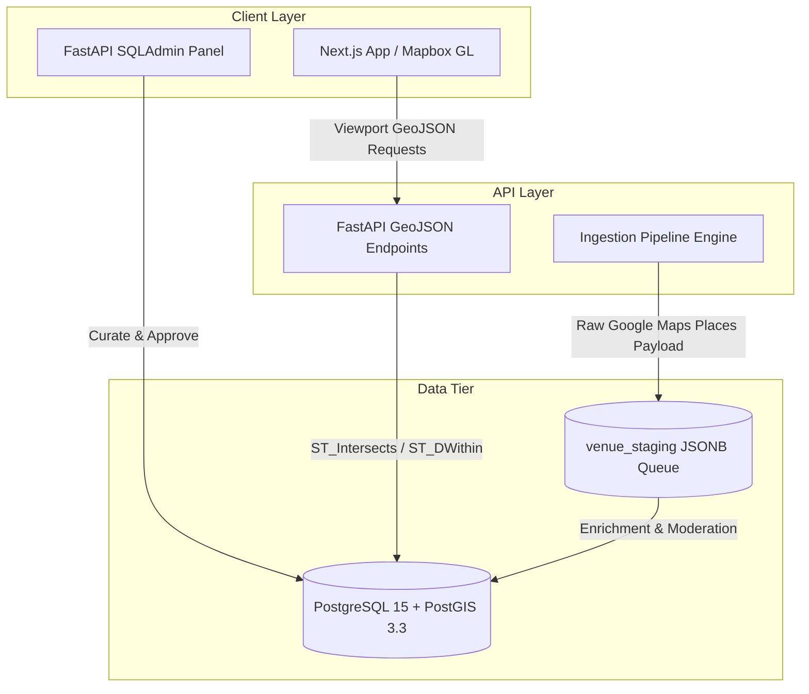

# System Architecture Overview

**System Type**: Decoupled Geospatial Directory & Community Routing Platform  
**Target Region**: Downtown Cairo (*Wust El Balad*) — Latitude 30°02′N, Longitude 31°14′E  
**Status**: Active Architecture Specification  

---

## Executive Summary

`barincairo.com` is a decoupled geospatial platform designed specifically for discovering, curating, and exploring venues, heritage sites, and bar-hopping routes in Downtown Cairo (*Wust El Balad*). The platform strictly separates spatial data querying and storage (FastAPI + PostGIS) from presentation cartography (Next.js client).

---

## High-Level Architecture Diagram

---

## Core Component Decoupling

1. **Spatial Data Engine (PostGIS)**:
   - All spatial calculations, distance metrics, and bounding-box spatial envelope filtering are executed inside PostgreSQL using native spatial indexes (`GIST`).
   - Spatial outputs are formatted directly as standard **SRID 4326 (WGS 84)** GeoJSON collections.

2. **Backend API (FastAPI)**:
   - High-throughput asynchronous endpoints delivering GeoJSON streams to clients.
   - Built-in `SQLAdmin` management portal for administrative curation and moderation of venue attributes.

3. **Frontend Cartography (Next.js)**:
   - Interactive cartographic presentation using Mapbox GL / MapLibre.
   - Zero spatial computation overhead on the client side; client simply renders standard GeoJSON feature collections.

---

## Related Documentation

- **[Geospatial Querying Strategy](geospatial-model.md)**: Deep dive into PostGIS spatial functions and indexing.
- **[REST API Specifications](../reference/api-endpoints.md)**: API contract details and GeoJSON response formats.
- **[PostGIS Database Schema](../reference/database-schema.md)**: Tables, spatial types, and index definitions.
