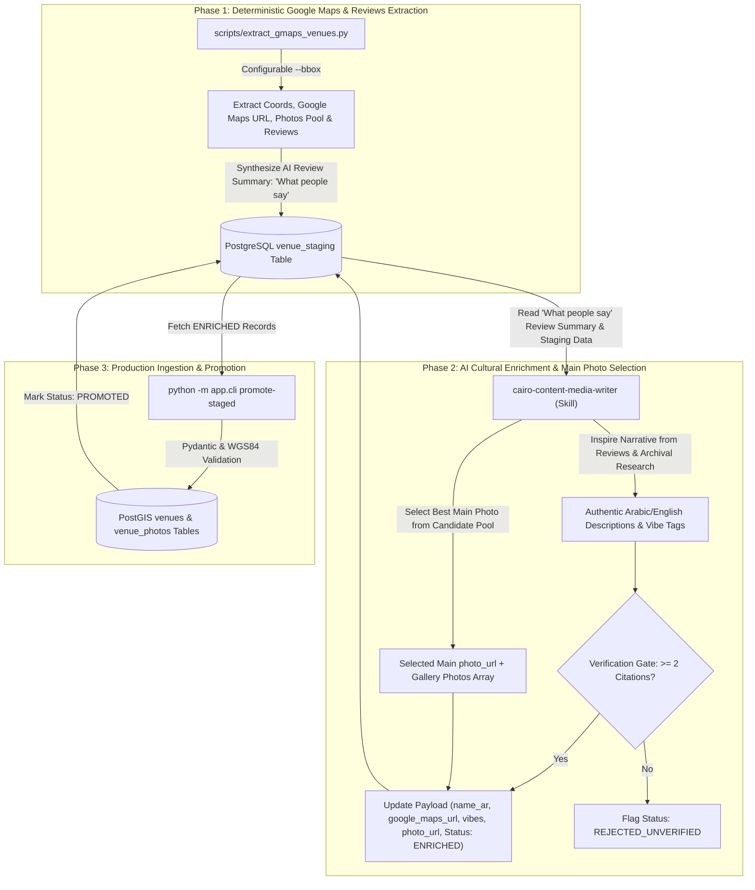

# Operational Guide: Hybrid Content Ingestion Pipeline

**Document Path**: `docs/ingestion-pipeline.md`  
**Target System**: `BARINCAIRO.COM` Content Ingestion & Geospatial Indexing Engine  
**Last Updated**: 2026-08-14  

---

## 1. Executive Overview

The **Hybrid Content Ingestion Pipeline** unifies deterministic Google Maps place extraction (with direct Google Maps links, candidate photo pools, and user reviews), PostgreSQL staging (`venue_staging`), AI cultural enrichment (`cairo-content-media-writer`), main hero photo selection, 2-citation verification gate, and zero-trust promotion into production PostGIS `venues` and `venue_photos` tables.



---

## 2. Configuring Search Bounding Box (`--bbox`)

The extraction script uses WGS84 geographic bounding box coordinates to scope spatial discovery.

### Bounding Box Parameter Syntax
```bash
--bbox "lat_min,lon_min,lat_max,lon_max"
```

### Pre-Configured Bounding Boxes

| Zone / Neighborhood | `lat_min` | `lon_min` | `lat_max` | `lon_max` | Bounding Box String |
| :--- | :--- | :--- | :--- | :--- | :--- |
| **Downtown Cairo (Default)** | `30.0380` | `31.2300` | `30.0520` | `31.2480` | `"30.0380,31.2300,30.0520,31.2480"` |
| **Zamalek Island** | `30.0500` | `31.2150` | `30.0750` | `31.2300` | `"30.0500,31.2150,30.0750,31.2300"` |
| **Garden City & Corniche** | `30.0300` | `31.2250` | `30.0420` | `31.2350` | `"30.0300,31.2250,30.0420,31.2350"` |
| **Heliopolis (Korba)** | `30.0850` | `31.3150` | `30.1000` | `31.3350` | `"30.0850,31.3150,30.1000,31.3350"` |

### How Bounding Box Validation Works
Any place extracted outside the specified `--bbox` coordinates is automatically skipped to prevent spatial scope drift.

---

## 3. Step-by-Step Execution Workflow

Run all CLI commands from the `backend/` directory with `PYTHONPATH=.`.

### Phase 1: Spatial Extraction & Staging
Extract place metadata, direct `google_maps_url`, candidate photos pool, and user reviews summary:

```bash
# Dry-run mode (Preview without database mutations)
PYTHONPATH=. venv/bin/python scripts/extract_gmaps_venues.py --bbox "30.0380,31.2300,30.0520,31.2480" --dry-run

# Staging mode (Upsert records into venue_staging)
PYTHONPATH=. venv/bin/python scripts/extract_gmaps_venues.py --bbox "30.0380,31.2300,30.0520,31.2480"
```

### Phase 2: AI Cultural Enrichment & 2-Citation Verification Gate
Process `PENDING_CURATION` staging records, select hero photo, author Egyptian Arabic copy, and enforce the 2-citation gate:

```bash
PYTHONPATH=. venv/bin/python -m app.cli enrich-staged
```

### Phase 3: Production Promotion & PostGIS Ingestion
Validate `ENRICHED` records using `VenueIngestSchema` and populate production `venues` and `venue_photos` tables:

```bash
PYTHONPATH=. venv/bin/python -m app.cli promote-staged --all
```

---

## 4. Quality Control, Deduplication & Verification

### 15-Meter PostGIS Spatial Deduplication
To prevent duplicate venue entries, the extraction engine checks existing records against 3 layers:
1. `place_id` uniqueness check in `venue_staging`.
2. PostGIS 15-meter spatial proximity check (`ST_DWithin`) in `venue_staging`.
3. PostGIS 15-meter spatial proximity check (`ST_DWithin`) in production `venues`.

### 2-Citation Verification Gate
Every record promoted to production MUST contain at least 2 historical/archival references in `citations: list[str]`. Records with fewer than 2 citations are flagged as `REJECTED_UNVERIFIED` and barred from promotion.

### SQLAdmin Operator Review
Staging records can be inspected and managed in real-time via the SQLAdmin dashboard at `http://localhost:8000/admin` under the **Venue Staging** section (`fa-layer-group`).

---

## 5. Automated Verification & Testing

Run the automated test suite and static analysis tools:

```bash
# Run pytest pipeline test suite
PYTHONPATH=. venv/bin/pytest tests/test_ingestion_pipeline.py tests/test_venue_ingest_schema.py

# Run static analysis
PYTHONPATH=. venv/bin/ruff check app scripts tests
PYTHONPATH=. venv/bin/mypy app/models/venue_staging.py app/schemas/venue_staging.py app/cli.py scripts/extract_gmaps_venues.py
```
