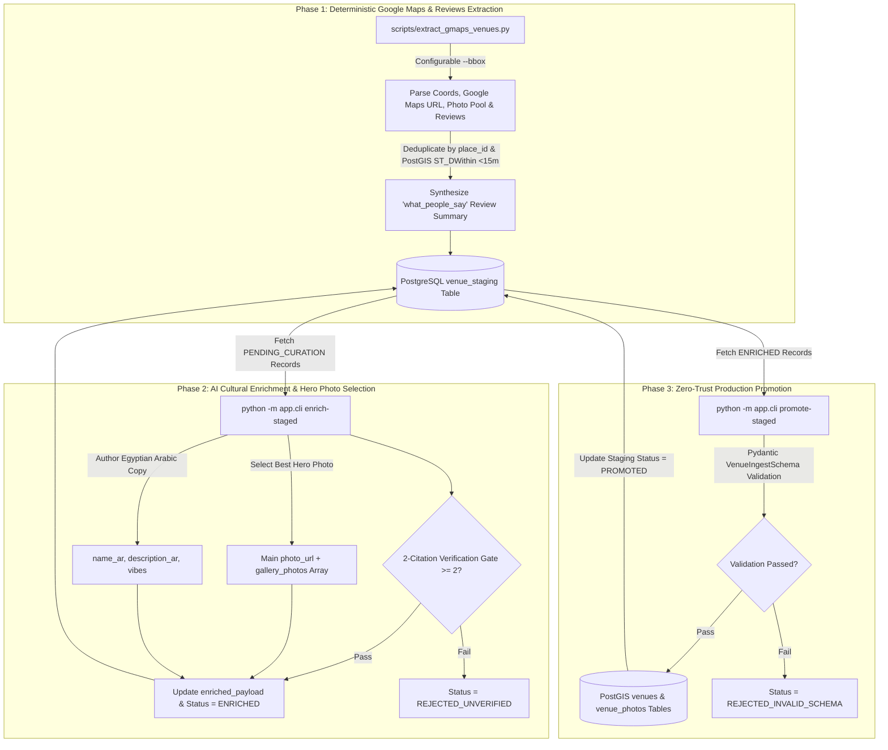
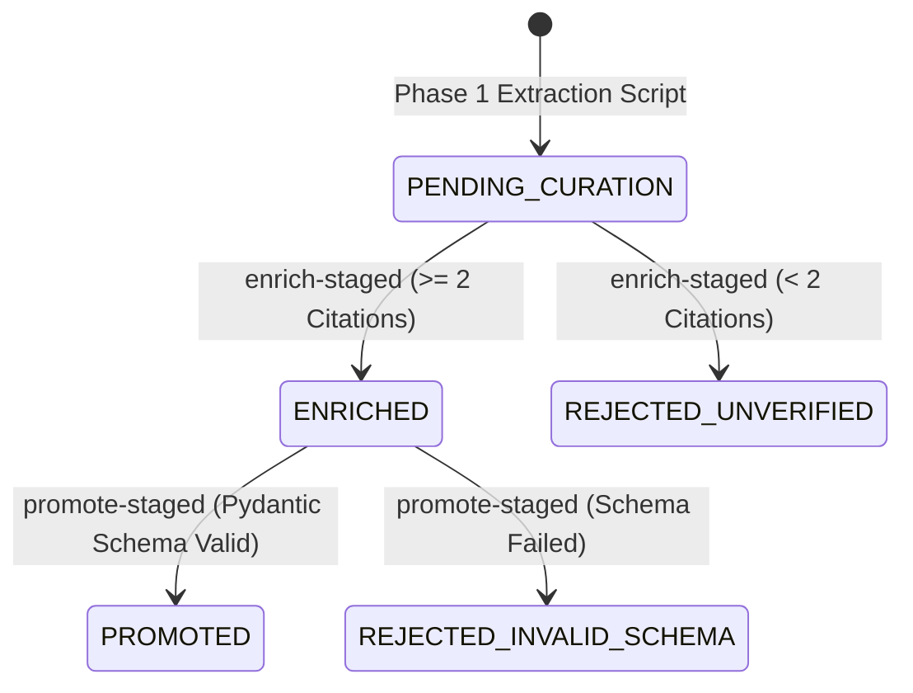

# Technical Design Document (TDD): Hybrid Content Ingestion Pipeline

**Document Path**: `docs/tdd-ingestion-pipeline.md`  
**System Name**: `BARINCAIRO.COM` Hybrid Ingestion & Geospatial Curation Engine  
**Author**: `cairo-architect`  
**Date**: 2026-08-14  
**Status**: Approved Technical Specification  

---

## 1. System Overview & Architectural Goals

### 1.1 Context & Problem Statement
Prior to the implementation of the Hybrid Ingestion Pipeline, `BARINCAIRO.COM` relied on static database seeding scripts for venue population. To enable scalable, continuous venue discovery across Downtown Cairo and adjacent historic districts, the system requires a 3-phase automated pipeline that combines deterministic Google Maps spatial extraction, PostgreSQL staging (`venue_staging`), AI cultural enrichment (`cairo-content-media-writer`), main hero photo selection, 2-citation verification, and zero-trust promotion to production PostGIS tables.

### 1.2 Architectural Directives & Goals
1. **Deterministic Extraction**: Extract place IDs, WGS84 coordinates, formatted addresses, candidate photo pools, user reviews, and direct Google Maps links (`google_maps_url`).
2. **Spatial Bounding Box Scoping**: Restrict spatial extraction strictly to defined geographic bounding boxes (`--bbox`) to enforce data density and prevent scope drift.
3. **Staging Queue Isolation**: Isolate extracted venue data in PostgreSQL (`venue_staging`) with full payload preservation (`raw_payload`, `enriched_payload`) before production promotion.
4. **PostGIS Proximity Deduplication**: Prevent duplicate entries by checking `place_id` uniqueness and 15-meter PostGIS spatial proximity (`ST_DWithin`).
5. **2-Citation Verification Gate**: Enforce mandatory $\ge 2$ archival/historical citation requirement for every promoted venue record.
6. **Zero-Trust Promotion**: Validate all enriched staging records through Pydantic `VenueIngestSchema` prior to inserting into production `venues` and `venue_photos` tables.

---

## 2. High-Level Pipeline Architecture



---

## 3. Data Dictionary & Database Schemas

### 3.1 PostgreSQL Staging Model (`venue_staging`)

```sql
CREATE TABLE venue_staging (
    id UUID PRIMARY KEY DEFAULT gen_random_uuid(),
    place_id VARCHAR(255) UNIQUE NOT NULL,
    google_maps_url TEXT NOT NULL,
    name_raw VARCHAR(255) NOT NULL,
    address_raw TEXT NOT NULL,
    location GEOMETRY(Point, 4326) NOT NULL,
    raw_payload JSONB NOT NULL,
    enriched_payload JSONB,
    status VARCHAR(50) DEFAULT 'PENDING_CURATION' NOT NULL,
    created_at TIMESTAMP WITH TIME ZONE DEFAULT CURRENT_TIMESTAMP NOT NULL,
    updated_at TIMESTAMP WITH TIME ZONE DEFAULT CURRENT_TIMESTAMP NOT NULL
);

CREATE UNIQUE INDEX ix_venue_staging_place_id ON venue_staging(place_id);
CREATE INDEX ix_venue_staging_status ON venue_staging(status);
CREATE INDEX idx_venue_staging_location ON venue_staging USING GIST (location);
```

#### JSONB Payload Specifications
- **`raw_payload`**:
  ```json
  {
    "place_id": "ChIJ_cap_dor_cairo_001",
    "candidate_photos": ["https://images.unsplash.com/photo-1", "https://images.unsplash.com/photo-2"],
    "reviews": ["Classic Downtown Cairo art-deco watering hole.", "Historical bar frequented by artists."],
    "what_people_say": "Visitors highlight: Classic Downtown Cairo art-deco watering hole | Historical bar frequented by artists.",
    "extracted_via": "extract_gmaps_venues.py"
  }
  ```
- **`enriched_payload`**:
  ```json
  {
    "slug": "cap-d-or",
    "category_slug": "bars",
    "name_en": "Cap d'Or (Bôite de Nuit)",
    "name_ar": "كاب دي أور",
    "description_en": "Historic Downtown Cairo watering hole established in the mid-20th century.",
    "description_ar": "بار تاريخي تأسس في منتصف القرن العشرين بوسط البلد.",
    "address_en": "27 Abdel Khalek Sarwat St, Downtown, Cairo",
    "address_ar": "٢٧ شارع عبد الخالق ثروت، وسط البلد، القاهرة",
    "google_maps_url": "https://www.google.com/maps/place/?q=place_id:ChIJ_cap_dor_cairo_001",
    "latitude": 30.0452,
    "longitude": 31.2385,
    "price_range": "$$",
    "vibe_description": "Nostalgic, retro art-deco pub",
    "photo_url": "https://images.unsplash.com/photo-1",
    "gallery_photos": ["https://images.unsplash.com/photo-2"],
    "vibes": ["historic", "cozy", "art-deco"],
    "citations": [
      "Cairo: The City Victorious by Max Rodenbeck, p. 142",
      "Downtown Cairo Heritage Survey Vol II"
    ]
  }
  ```

### 3.2 Production Schema Updates (`venues`)
Added column `google_maps_url: Text` (nullable) to store direct Google Maps navigation links.

```sql
ALTER TABLE venues ADD COLUMN google_maps_url TEXT;
```

---

## 4. Component Algorithms & Business Logic

### 4.1 Bounding Box Spatial Filtering Algorithm
Given bounding box string `"lat_min,lon_min,lat_max,lon_max"`:
- Latitude validation: $\text{lat}_{\min} \le \text{latitude} \le \text{lat}_{\max}$
- Longitude validation: $\text{lon}_{\min} \le \text{longitude} \le \text{lon}_{\max}$
- Default Downtown Cairo coordinates: `30.0380,31.2300,30.0520,31.2480`

### 4.2 PostGIS 15-Meter Proximity Deduplication Algorithm
To check if a candidate point $(\text{lon}, \text{lat})$ is spatially duplicate with existing staged or production venues within 15 meters:

```sql
SELECT id FROM venue_staging
WHERE ST_DWithin(
    ST_Transform(location, 3857),
    ST_Transform(ST_SetSRID(ST_MakePoint(:lon, :lat), 4326), 3857),
    15.0
);
```

### 4.3 2-Citation Verification Gate Engine
Pydantic validation rule enforced on `VenueIngestSchema`:
```python
citations: list[str] = Field(
    ...,
    min_length=2,
    description="2-Citation Verification Gate (at least 2 verified sources/citations required)",
)
```
If `len(citations) < 2`, the record transitions to `REJECTED_UNVERIFIED` state and is blocked from production promotion.

---

## 5. Staging Lifecycle State Machine



---

## 6. Verification & Automated Test Coverage

The implementation includes automated unit and integration tests under [`backend/tests/`](file:///var/www/barincairo.com/backend/tests/):

1. **`test_is_within_bbox`**: Tests WGS84 bounding box filtering logic.
2. **`test_synthesize_what_people_say`**: Tests review summary block construction.
3. **`test_two_citation_gate_validation`**: Tests 2-citation gate pass/fail conditions.
4. **`test_end_to_end_ingestion_pipeline`**: Complete multi-stage integration test covering extraction, staging, enrichment, and production promotion.

### Automated Test Execution Command
```bash
PYTHONPATH=. venv/bin/pytest tests/test_ingestion_pipeline.py tests/test_venue_ingest_schema.py
```
